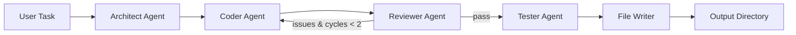

# Multi-Agent Collaborative Coding System

A production-grade system where 4 specialized AI agents collaborate to plan, code, review, and test software — like a mini AI dev team.

## Architecture

```
User Task --> Architect --> Plan --> Coder --> Code --> Reviewer --> Feedback
                                      ^                    |
                                      +---- Fix Loop ------+
                              Code (fixed) --> Tester --> Final Results --> Output
```



### The Agents

| Agent | Role | Color |
|-------|------|-------|
| **Architect** | Analyzes the task, creates a plan, defines file structure, picks technologies | Blue |
| **Coder** | Takes the plan and writes production-quality code file by file | Green |
| **Reviewer** | Reviews code for bugs, security issues, and best practices | Yellow |
| **Tester** | Writes pytest tests for the generated code | Magenta |

The Reviewer can send code back to the Coder up to **2 times** for fixes (configurable). After that, it moves to testing regardless.

## Features

- **4 specialized agents** with distinct roles and system prompts
- **LangGraph state machine** for orchestration with conditional edges
- **Review loop** with configurable max cycles to catch and fix bugs
- **Rich terminal UI** with color-coded agent logs, progress display, and syntax highlighting
- **REST API** via FastAPI for programmatic access
- **Token tracking** with cost estimation per run
- **Robust file parsing** for XML-style code output from the LLM
- **Sandboxed execution** via subprocess with timeouts

## Tech Stack

- **Python 3.11+**
- **LangGraph** — agent orchestration and state machine workflow
- **Anthropic SDK** — Claude Sonnet 4 as the LLM backbone
- **Pydantic v2** — structured state and message schemas
- **Rich** — terminal UI with colors, panels, tables, and syntax highlighting
- **FastAPI + Uvicorn** — REST API
- **pytest** — test generation and execution

## Setup

### 1. Clone the repository

```bash
git clone <repo-url>
cd multi-agent-coder
```

### 2. Install dependencies

```bash
pip install -r requirements.txt
```

### 3. Configure environment

```bash
cp .env.example .env
# Edit .env and add your Anthropic API key
```

### 4. Run

**CLI mode:**
```bash
python main.py "Build a REST API for a todo app with FastAPI"
```

**Interactive mode:**
```bash
python main.py
# Then enter your task when prompted
```

**API mode:**
```bash
python -m api.server
# Or: uvicorn api.server:app --reload

# Then POST to the endpoint:
curl -X POST http://localhost:8000/generate \
  -H "Content-Type: application/json" \
  -d '{"task": "Build a REST API for a todo app"}'
```

## API Endpoints

| Method | Path | Description |
|--------|------|-------------|
| `GET` | `/health` | Health check |
| `POST` | `/generate` | Run the full agent pipeline |

### POST /generate

**Request:**
```json
{
  "task": "Build a simple Python REST API using FastAPI that manages a todo list"
}
```

**Response:**
```json
{
  "status": "success",
  "files": {"app/main.py": "...", "app/models.py": "..."},
  "test_files": {"tests/test_main.py": "..."},
  "test_results": "...",
  "architecture_plan": "...",
  "review_feedback": "...",
  "review_cycles": 1,
  "total_input_tokens": 12345,
  "total_output_tokens": 6789,
  "errors": []
}
```

## How It Works

1. **Architect** receives the user's task and creates a detailed implementation plan including file structure, technology choices, and specifications.
2. **Coder** takes the plan and generates complete, runnable code files wrapped in XML-style tags.
3. **Reviewer** inspects every file for bugs, security issues, missing imports, and quality problems. It assigns a severity rating.
4. If issues are found and the review cycle limit hasn't been reached, code goes back to the **Coder** for fixes.
5. **Tester** generates pytest test files for the final code.
6. All files (code + tests) are written to the `output/` directory with a timestamped subdirectory.

## Cost Estimation

Using Claude Sonnet 4 ($3/M input, $15/M output):

| Task Complexity | Estimated Tokens | Estimated Cost |
|----------------|-----------------|----------------|
| Simple (todo API) | ~15K input, ~8K output | ~$0.17 |
| Medium (auth + CRUD) | ~25K input, ~15K output | ~$0.30 |
| Complex (multi-service) | ~40K input, ~25K output | ~$0.50 |

Costs vary based on review cycles and code complexity.

## Configuration

Environment variables (in `.env`):

| Variable | Default | Description |
|----------|---------|-------------|
| `ANTHROPIC_API_KEY` | — | Your Anthropic API key (required) |
| `MODEL_NAME` | `claude-sonnet-4-20250514` | LLM model to use |
| `MAX_TOKENS` | `8096` | Max tokens per LLM call |
| `MAX_REVIEW_CYCLES` | `2` | Max review-fix iterations |
| `OUTPUT_DIR` | `output` | Base directory for generated files |

## Project Structure

```
multi-agent-coder/
├── agents/              # Agent implementations
│   ├── base.py          # Base agent with LLM calls, logging, retries
│   ├── architect.py     # Architecture planning
│   ├── coder.py         # Code generation + file parser
│   ├── reviewer.py      # Code review
│   └── tester.py        # Test generation
├── orchestrator/        # Workflow engine
│   ├── graph.py         # LangGraph state machine
│   └── state.py         # Pydantic shared state
├── tools/               # Utilities
│   ├── file_manager.py  # Disk I/O for generated files
│   └── code_runner.py   # Sandboxed subprocess execution
├── prompts/             # System prompts for each agent
│   └── system_prompts.py
├── api/                 # REST API
│   └── server.py        # FastAPI server
├── output/              # Generated project files
├── tests/               # System tests
├── main.py              # CLI entry point
└── requirements.txt
```

## Future Improvements

- Async pipeline execution with streaming progress updates
- Support for multiple LLM providers (OpenAI, Gemini)
- Persistent task history with database storage
- Web UI dashboard for monitoring agent progress
- Docker containerization for sandboxed code execution
- Multi-language support (JavaScript, Go, Rust)
- Agent memory for learning from past tasks

## License

MIT
